# 🚀 Allure Hosting — AWS CDK Infrastructure

[](https://aws.amazon.com/cdk/)
[](https://www.typescriptlang.org/)
[](https://opensource.org/licenses/MIT)

This repository provides a **secure, scalable AWS CDK infrastructure** for hosting Allure test reports using private S3 buckets served through CloudFront with Origin Access Identity (OAI).

## 🏗️ Architecture Overview

```mermaid
flowchart TB
    subgraph Internet ["Internet"]
        User["👤 User / CI Pipeline"]
        Browser["🌐 Browser"]
    end

    subgraph AWSCloud ["AWS Cloud"]
        subgraph EdgeGlobal ["Edge (Global)"]
            CF["☁️ CloudFront Distribution<br/>Custom Domain Support<br/>HTTPS Only<br/>Caching Disabled<br/>SPA Routing (403/404 to index.html)"]
        end

        subgraph RegionUSEast1 ["Region (us-east-1)"]
            ACM["🔒 ACM Certificate<br/>(Optional)"]

            subgraph S3Subsystem ["S3"]
                S3["🪣 S3 Bucket<br/>Block Public Access<br/>Enforce SSL<br/>Auto-delete Objects"]
            end

            OAI["🔑 Origin Access Identity<br/>CloudFront to S3 Access"]
        end
    end

    User -->|Upload Reports| S3
    Browser -->|HTTPS Requests| CF
    CF -->|Authenticated Access| OAI
    OAI -->|Read Access| S3
    ACM -.->|SSL Certificate| CF

    style CF fill:#ff9900,stroke:#232f3e,color:#fff
    style S3 fill:#3f8624,stroke:#232f3e,color:#fff
    style ACM fill:#ff4b4b,stroke:#232f3e,color:#fff
    style OAI fill:#146eb4,stroke:#232f3e,color:#fff
```



## ✨ Features

### 🔒 Security First

- **Private S3 Bucket** with `Block Public Access` enabled
- **Origin Access Identity (OAI)** for CloudFront-only access
- **Enforce SSL** on all S3 operations
- **HTTPS-only** CloudFront distribution

### 🌐 Performance & Reliability

- **Global CDN** via CloudFront edge locations
- **Custom domain** support with ACM certificates
- **SPA routing** - 403/404 errors redirect to `index.html`
- **Caching disabled** for fresh report delivery

### 🛠️ Developer Experience

- **Infrastructure as Code** with AWS CDK TypeScript
- **Deterministic naming** with account ID suffix
- **Stack outputs** for CI/CD integration
- **Auto-cleanup** on stack deletion

---

## 🚀 Quick Start

### Prerequisites

- **Node.js 18+**
- **AWS CLI** configured with appropriate permissions
- **AWS CDK** installed globally

### Installation

1. **Clone the repository:**

   ```bash
   git clone https://github.com/darrenrabbs/allurehosting-cdk.git
   cd allurehosting-cdk/cdk
   ```

2. **Install dependencies:**

   ```bash
   npm install
   ```

3. **Bootstrap CDK (first time only):**
   ```bash
   npx cdk bootstrap aws://<ACCOUNT_ID>/<REGION>
   ```

### 🚀 Deployment

#### Basic Deployment (CloudFront domain only)

```bash
# Synthesize the CloudFormation template
npx cdk synth -c project=myproject -c region=us-east-1

# Deploy the stack
npx cdk deploy -c project=myproject -c region=us-east-1
```

#### Advanced Deployment (Custom Domain)

```bash
# Deploy with custom domain (requires ACM certificate in us-east-1)
npx cdk deploy \
  -c project=myproject \
  -c region=us-east-1 \
  -c domainName=reports.example.com \
  -c acmCertArn=arn:aws:acm:us-east-1:123456789012:certificate/abc-123
```

### 📤 Stack Outputs

After successful deployment, the stack provides:

| Output              | Description                    | Usage                            |
| ------------------- | ------------------------------ | -------------------------------- |
| `bucket`            | S3 bucket name                 | For uploading reports via CLI/CI |
| `cloudfront_domain` | CloudFront distribution domain | HTTPS URL for accessing reports  |

### 🔗 Integration Example

Use the stack outputs with your CI/CD pipeline:

```bash
# Example with a fictional publish-allure tool
publish-allure \
  --bucket $(aws cloudformation describe-stacks \
    --stack-name myproject-allurehosting \
    --query 'Stacks[0].Outputs[?OutputKey==`bucket`].OutputValue' \
    --output text) \
  --project myproject \
  --branch main \
  --cloudfront https://$(aws cloudformation describe-stacks \
    --stack-name myproject-allurehosting \
    --query 'Stacks[0].Outputs[?OutputKey==`cloudfrontdomain`].OutputValue' \
    --output text)
```

---

## 📋 Configuration Options

| Parameter    | Required | Description                                | Example                                     |
| ------------ | -------- | ------------------------------------------ | ------------------------------------------- |
| `project`    | ✅       | Project name (used in resource naming)     | `myproject`                                 |
| `region`     | ✅       | AWS region for deployment                  | `us-east-1`                                 |
| `domainName` | ❌       | Custom domain for CloudFront               | `reports.example.com`                       |
| `acmCertArn` | ❌       | ACM certificate ARN (must be in us-east-1) | `arn:aws:acm:us-east-1:123:certificate/abc` |

---

## 🗂️ Project Structure

```
allurehosting-cdk/
├── 📄 README.md                    # This file
├── 📄 .gitignore                   # Git ignore patterns
└── cdk/                            # CDK application
    ├── 📄 package.json             # Node.js dependencies
    ├── 📄 tsconfig.json            # TypeScript configuration
    ├── 📄 cdk.json                 # CDK configuration
    ├── bin/
    │   └── 📄 allurehosting.ts     # CDK app entry point
    └── lib/
        └── 📄 allurehosting-stack.ts # Stack definition
```

---

## 🛠️ Development

### Local Development

```bash
# Watch mode for TypeScript compilation
npm run watch

# Synthesize CloudFormation template
npm run synth

# Run CDK diff
npm run diff
```

### Stack Management

```bash
# List all stacks
npx cdk list

# View differences before deployment
npx cdk diff -c project=myproject

# Destroy the stack
npx cdk destroy -c project=myproject
```

---

## 🔧 Troubleshooting

### Common Issues

**🚨 Bootstrap Required**

```
Error: Need to perform AWS CDK bootstrap
```

**Solution:** Run `npx cdk bootstrap aws://<ACCOUNT_ID>/<REGION>`

**🚨 Certificate Region Error**

```
CloudFront requires certificates to be in us-east-1
```

**Solution:** Ensure ACM certificate is created/imported in `us-east-1` region

**🚨 Bucket Already Exists**

```
Bucket already exists in another account
```

**Solution:** The bucket name includes account ID for uniqueness. Check if stack already exists.

### Debug Mode

```bash
# Enable CDK debug logging
npx cdk deploy --debug -c project=myproject
```

---

## 🤝 Contributing

1. **Fork** the repository
2. **Create** a feature branch: `git checkout -b feature/amazing-feature`
3. **Commit** your changes: `git commit -m 'Add amazing feature'`
4. **Push** to the branch: `git push origin feature/amazing-feature`
5. **Open** a Pull Request

---

## 📜 License

This project is licensed under the **MIT License** - see the [LICENSE](LICENSE) file for details.

---

## 🔗 Related Projects

- [AWS CDK Documentation](https://docs.aws.amazon.com/cdk/)
- [Allure Framework](https://allurereport.org/)
- [AWS CloudFront](https://aws.amazon.com/cloudfront/)
- [AWS S3](https://aws.amazon.com/s3/)

---

<div align="center">

**⭐ Star this repository if it helped you! ⭐**

Made with ❤️ for the testing community

</div>
